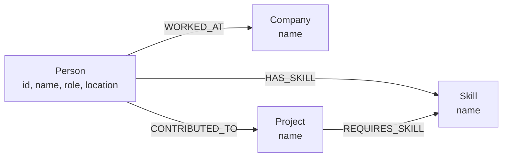
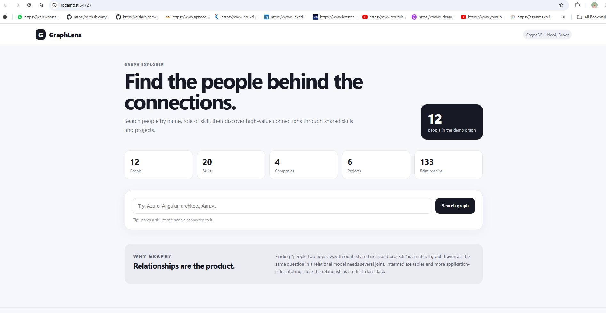
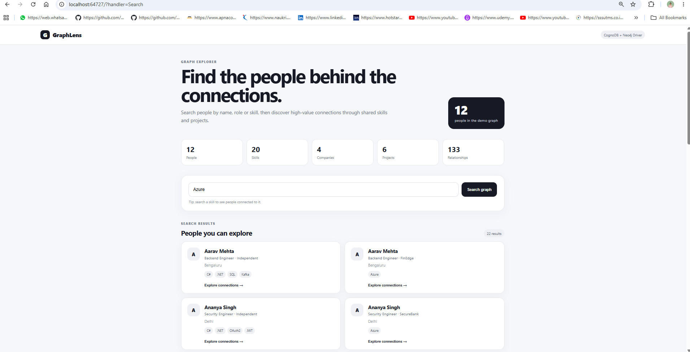
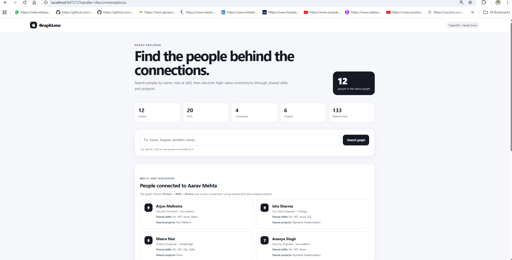

# GraphLens — Wexa AI CognoDB Take-Home

GraphLens is a small relationship-exploration web application built for the Wexa AI take-home assignment.

It uses **ASP.NET Core Razor Pages + C# + the official Neo4j .NET driver + CognoDB** to help users discover people and relationships through shared technical skills and project experience.

---

## 1. Use Case

### Problem

A recruiter, engineering manager or delivery lead wants to discover people who are relevant to a person based on shared technical skills and shared project experience.

Example question::

> "Who is connected to Aarav through shared skills, and who has also worked on the same projects?"

GraphLens allows a user to search people by:

- Name
- Role
- Skill
- Company

Users can then explore relevant connections based on shared skills and projects.

---

## 2. Why a Graph Database?

This problem is relationship-heavy.

The useful information is not only that a person has a skill. The important part is the relationship chain connecting:

- People
- Skills
- Projects
- Companies

The recommendation flow traverses:

```text
Person → HAS_SKILL → Skill ← HAS_SKILL ← Person
```

and can also identify shared projects:

```text
Person → CONTRIBUTED_TO → Project ← CONTRIBUTED_TO ← Person
```

A relational implementation would require several join tables and multi-stage joins before the application could reconstruct the same relationship network.

With a graph database, relationships are first-class data and traversal is explicit.

---

## 3. Graph Data Model



### Main entities

| Entity | Description |
|---|---|
| Person | Person information such as name, role and location |
| Skill | Technical or professional skill |
| Company | Company associated with a person |
| Project | Project contributed to by a person |

### Main relationships

| Relationship | Meaning |
|---|---|
| `HAS_SKILL` | Person has a particular skill |
| `WORKED_AT` | Person worked at a company |
| `CONTRIBUTED_TO` | Person contributed to a project |
| `REQUIRES_SKILL` | Project requires a particular skill |

---

## 4. Technology Stack

- .NET 8
- ASP.NET Core Razor Pages
- C#
- CognoDB
- Official `Neo4j.Driver`
- openCypher
- Bolt protocol
- HTML / CSS
- Parameterised graph queries

CognoDB provides Bolt connectivity and compatibility with the official Neo4j driver.

---

## 5. Project Structure

The repository contains both the web application and the database seed project.

```text
WexaGraphExplorer/
│
├── GraphExplorer.csproj
├── Program.cs
│
├── Seed.csproj
├── SeedProgram.cs
│
├── Data/
├── Models/
├── Pages/
├── Services/
├── Cypher/
├── wwwroot/
├── Properties/
│
├── .gitignore
├── appsettings.json
├── SETUP.md
└── README.md
```

### GraphExplorer

`GraphExplorer.csproj` is the main ASP.NET Core Razor Pages web application.

It is responsible for:

- Displaying the GraphLens UI
- Searching the graph
- Retrieving graph statistics
- Finding people
- Finding multi-hop recommendations
- Displaying shared skills and projects

### Seed

`Seed.csproj` is the database seeding application.

It is responsible for:

- Connecting to CognoDB
- Creating demo people
- Creating skills
- Creating companies
- Creating projects
- Creating graph relationships

---

## 6. CognoDB Configuration

The application requires the following configuration values:

```text
COGNODB_URI
COGNODB_USERNAME
COGNODB_PASSWORD
```

### Windows PowerShell

```powershell
$env:COGNODB_URI="bolt+s://<instance-id>.databases.cognodb.cloud"
$env:COGNODB_USERNAME="cognodb"
$env:COGNODB_PASSWORD="<your-password>"
```

The credentials are supplied through environment variables and are not hard-coded in the application.

### Security

Do not commit:

- CognoDB passwords
- `.env` files containing secrets
- Local secret configuration
- Connection credentials

---

## 7. Seed the Database

The seed project prepares the demo graph used by GraphLens.

From the repository root:

```powershell
dotnet restore
dotnet run --project .\Seed.csproj
```

A successful execution displays:

```text
Seed completed.
```

### Idempotent Seeding

The seed process uses `MERGE` for graph entities and relationships so that the seed can be executed repeatedly without intentionally creating duplicate demo data.

This makes it safe to re-run the seed when rebuilding or resetting the development environment.

---

## 8. Run the Web Application

After the database has been seeded, run the GraphExplorer application.

From the repository root:

```powershell
dotnet run --project .\GraphExplorer.csproj
```

The application starts on the localhost URL displayed in the terminal.

Example:

```text
Now listening on: http://localhost:5000
```

Open the displayed URL in a browser.

---

## 9. Main Graph Queries

### Search

The application searches across people, roles, skills and companies using a parameterised query.

Example:

```cypher
WHERE toLower(p.name) CONTAINS toLower($term)
   OR toLower(p.role) CONTAINS toLower($term)
   OR toLower(s.name) CONTAINS toLower($term)
   OR toLower(c.name) CONTAINS toLower($term)
```

User input is passed as a Cypher parameter rather than being concatenated directly into the query.

### Multi-Hop Recommendations

The recommendation query starts from a person and traverses shared skills:

```cypher
MATCH (me:Person {id: $personId})
      -[:HAS_SKILL]->
      (shared:Skill)
      <-[:HAS_SKILL]-
      (other:Person)
```

This represents:

```text
Person → Skill ← Person
```

The query can then identify shared project relationships:

```text
Person → Project ← Person
```

The application uses an explainable connection score based on:

```text
2 × shared skills + shared projects
```

---

## 10. Seeded Demo Graph

The seeded demo graph contains:

- **12 People**
- **20 Skills**
- **4 Companies**
- **6 Projects**
- **133 Relationships**

The seeded data supports relationship exploration through skills, companies and projects.

---

## 11. Application Features

### Dashboard

The home page displays graph statistics such as:

- People
- Skills
- Companies
- Projects
- Relationships

### Search

Users can search for examples such as:

```text
Azure
Angular
Aarav
```

### Explore Connections

After finding a person, the user can select:

```text
Explore connections
```

The application then displays relevant people based on shared skills and projects.

The recommendation screen explains the connection using:

- Shared skills
- Shared projects
- Connection score

---

## 12. Error Handling

Database failures are handled in the service layer.

The application logs the database exception and presents a user-friendly error instead of exposing database details directly to the user.

The application also provides a health endpoint:

```text
GET /health
```

The health endpoint can be used to verify application connectivity to CognoDB.

---

## 13. Local Verification Checklist

Before submission, verify the following:

- [x] CognoDB instance created
- [x] CognoDB credentials configured
- [x] Seed script completed successfully
- [x] Demo graph data created
- [x] Search works for `Azure`
- [x] Search works for `Angular`
- [x] Search works for `Aarav`
- [x] Explore connections works
- [x] Shared skills are displayed
- [x] Shared projects are displayed
- [ ] `/health` returns HTTP 200
- [ ] Invalid/unavailable database shows a graceful error
- [ ] No credentials are committed to Git
- [ ] Screenshots added
- [ ] GitHub repository pushed
- [ ] Hosted demo added

---

## 14. Screenshots

### Dashboard



### Search Results



### Multi-Hop Recommendations



## 15. GitHub Submission

Initialize the repository if required:

```powershell
git init
```

Add the files:

```powershell
git add .
```

Create the first commit:

```powershell
git commit -m "Build CognoDB graph explorer"
```

Set the main branch:

```powershell
git branch -M main
```

Add the GitHub repository:

```powershell
git remote add origin <YOUR_GITHUB_REPOSITORY>
```

Push the project:

```powershell
git push -u origin main
```

### Important

Do not commit:

- Passwords
- `.env` files
- Secret configuration
- Local credentials

---

## 16. Deployment

For a hosted demo, deploy the ASP.NET Core application to a hosting platform that supports .NET 8.

Configure the following environment variables in the hosting environment:

```text
CognoDb__Uri
CognoDb__Username
CognoDb__Password
```

The CognoDB instance should remain available while the assignment is being evaluated.
